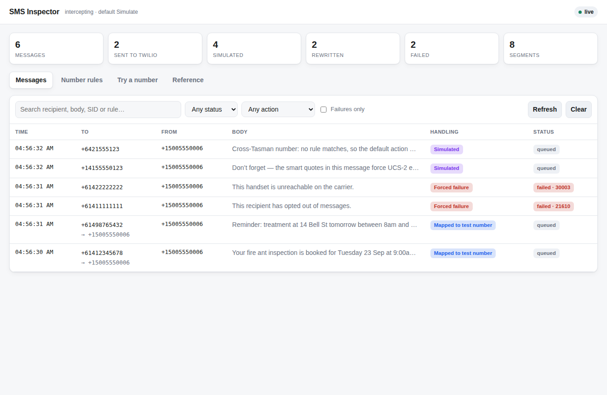
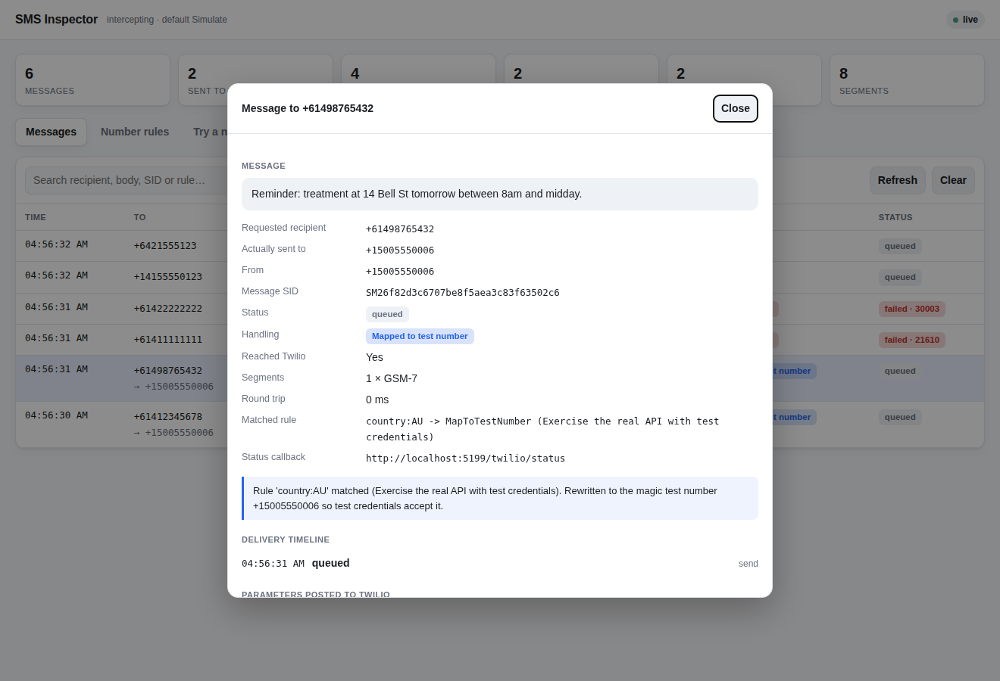
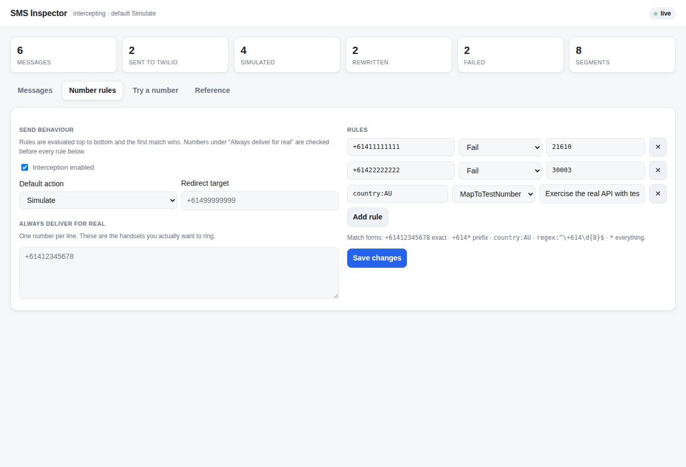
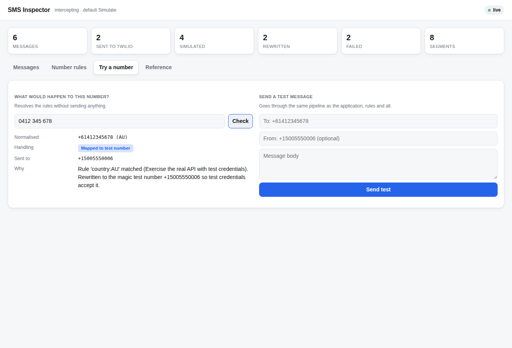
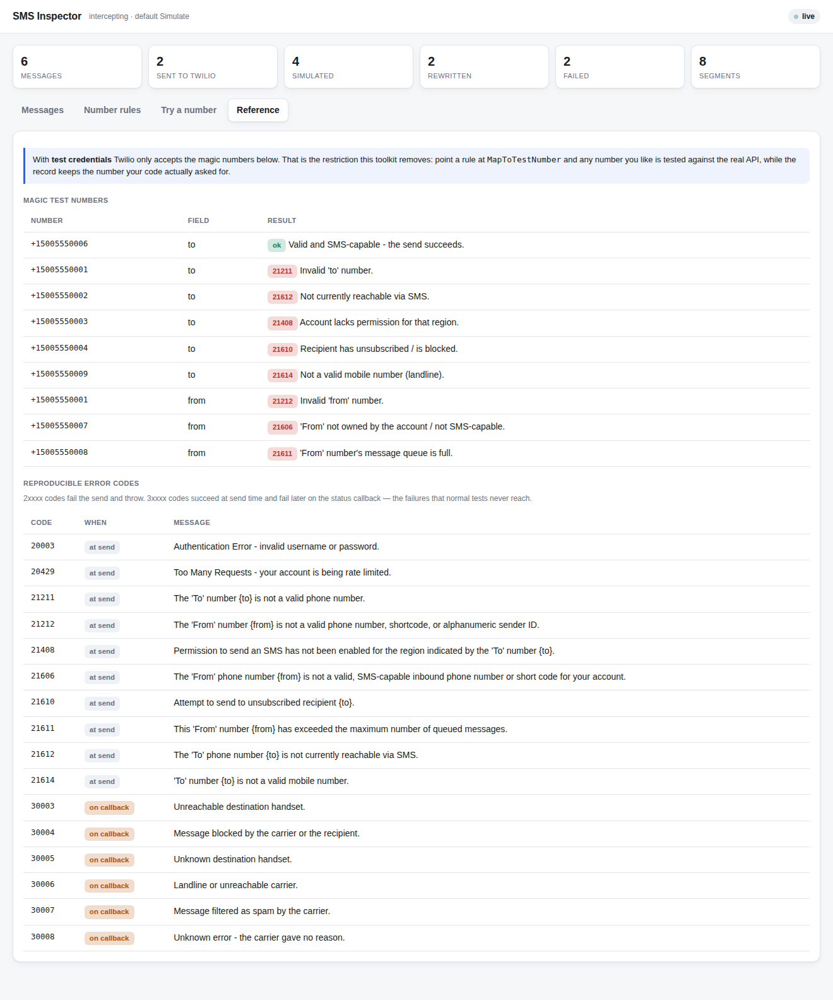

# TwilioDevKit

Two things that are awkward when a .NET system sends SMS through Twilio:

1. **With test credentials, Twilio only accepts a handful of fixed "magic" numbers.** You
   cannot point a test at a real handset, a staging fixture, or the number from a customer's
   bug report.
2. **There is nowhere to see what the system actually sent.** Answering "did we text this
   person, and what did it say?" means logging into the Twilio console, if you have access.

This package fixes both, and plugs into an existing application in **two lines**.

```csharp
builder.Services.AddTwilioDevKit(builder.Configuration);  // wraps the Twilio client
app.UseTwilioInspector();                                 // serves the screen at /_twilio
```

No call sites change. No wrapper service to adopt. Nothing to undo later.

---

## Why it is only two lines

Every call in the Twilio .NET SDK takes an `ITwilioRestClient`:

```csharp
await MessageResource.CreateAsync(to: ..., from: ..., body: ..., client: client);
```

TwilioDevKit registers a decorator around whatever `ITwilioRestClient` the application
already has. It inspects outbound `POST /Messages.json` requests, applies the number rules,
records the attempt, and forwards or answers the call itself. Every other request - fetches,
lookups, Voice, Verify - passes straight through untouched.

Because the interception happens at the transport interface, code that sends SMS does not
change at all, and the toolkit can be switched off with one config flag.

---

## 1. Test any number you like

Rules are evaluated top to bottom, first match wins:

```jsonc
{
  "TwilioDevKit": {
    "Enabled": true,
    "DefaultAction": "Simulate",
    "DefaultCountry": "AU",

    // These handsets really do ring.
    "AllowedNumbers": [ "+61412345678" ],

    "Rules": [
      // Deliberate failures, for the paths that are hard to reach on purpose.
      { "Match": "+61411111111", "Action": "Fail", "ErrorCode": 21610, "Note": "unsubscribed" },
      { "Match": "+61422222222", "Action": "Fail", "ErrorCode": 30003, "Note": "handset unreachable" },

      // Everything else Australian goes through the real API using a magic test number.
      { "Match": "country:AU", "Action": "MapToTestNumber" }
    ]
  }
}
```

### The five actions

| Action | What happens | Reaches Twilio |
|---|---|---|
| `Allow` | Sent for real, untouched. | yes |
| `Simulate` | Never contacts Twilio. A real `MessageResource` with a SID comes back. | no |
| `MapToTestNumber` | Recipient is rewritten to a magic test number so **test credentials accept it**, then really sent. The record keeps the number you asked for. | yes |
| `Redirect` | Really sent, but to a safe number you control. The intended recipient is prepended to the body. | yes |
| `Fail` | Fails with a Twilio error code of your choosing, without contacting Twilio. | no |

`MapToTestNumber` is the one that removes the original restriction. Your code asks for
`+61412345678`; Twilio is asked for `+15005550006` and accepts it; the screen shows both.

The sample application proves the point. It ships with a stand-in that enforces the same
magic-number restriction test credentials do, so you can watch one rule change fix a send:

```console
# Rule: +61477777777 -> Allow. Sent straight to the API using test credentials.
$ curl -XPOST localhost:5199/send -d '{"to":"+61477777777", ...}'
{"error":"The 'To' number +61477777777 is not a valid phone number.","code":21211,"status":400}

# Same number, same message. Rule changed to MapToTestNumber, no restart.
$ curl -XPOST localhost:5199/send -d '{"to":"+61477777777", ...}'
{"sid":"SM8525ded2725e049ccef4187a223a4d27","status":"queued","to":"+15005550006"}
```

### Match forms

| Form | Example | Matches |
|---|---|---|
| Exact | `+61412345678` | that number, in any format |
| Prefix | `+614*` | every Australian mobile |
| Country | `country:AU` | every number in that country |
| Regex | `regex:^\+614\d{8}$` | anything you can express |
| Everything | `*` | the catch-all |

Numbers are normalised before comparison, so a rule written `0412 345 678` matches a send to
`+61412345678` when `DefaultCountry` is `AU`.

---

## 2. See what was sent

`app.UseTwilioInspector()` serves a screen at `/_twilio` - one self-contained HTML document,
no framework, no bundler, no CDN, nothing added to the host application's asset pipeline.



<sub>Dark mode is supported too - see [docs/images/inspector-messages-dark.png](docs/images/inspector-messages-dark.png).</sub>

Every attempt is recorded, including ones that never reached Twilio and ones that failed.
Clicking a row explains exactly what happened and why:



It shows:

- the recipient you asked for **and** the one actually used, when they differ;
- the full body, and every parameter posted to Twilio;
- which rule matched, and why it applied, in plain English;
- the delivery timeline as status callbacks arrive;
- billable segments and encoding - including *which character* forced a message from GSM-7
  (160 chars/segment) down to UCS-2 (70), which is normally invisible until the bill arrives.

The list updates live over server-sent events, so a message appears the moment the
application sends it.

### Changing the rules without a restart

The **Number rules** tab edits the live policy. Add a number to the allow-list, flip the
default action, or point a number at a specific Twilio error, and the next send obeys it
immediately.



### Answering "why did that go there?"

**Try a number** resolves the rules for any number without sending anything, and will send a
test message through the same pipeline the application uses.



### The reference tab

Twilio's magic numbers and the reproducible error codes, so nobody has to go looking for them.



---

## Delivery receipts, simulated

Delivery outcomes arrive asynchronously on a webhook, so code that handles `delivered` or
`failed` normally cannot be exercised without sending a real message and waiting for a
carrier. Turn this on and the whole lifecycle is replayed against your own webhook:

```jsonc
"StatusCallbacks": {
  "Enabled": true,
  "Sequence": [ "queued", "sent", "delivered" ],
  "DelayMs": 900,
  "SigningAuthToken": "your-test-auth-token"   // optional
}
```

With `SigningAuthToken` set, each callback carries a real `X-Twilio-Signature`, so
signature-validating endpoints accept it - you test the validating path rather than turning
validation off for testing. (There is a test that checks our signature against Twilio's own
`RequestValidator`.)

A `Fail` rule with a **3xxxx** code is delivered the way Twilio delivers it: the send
succeeds, and the failure turns up later on the callback. That is the case code usually
misses, because a `try/catch` around the send never sees it.

Real Twilio callbacks can be recorded too - point Twilio's status callback at
`/_twilio/webhook/status` and delivery outcomes attach to the matching message.

---

## Safety

The defaults are inert, and the guards are deliberate:

- `Enabled` defaults to **false**. Adding the package changes nothing until somebody opts in.
- Interception **switches itself off in the Production environment** unless
  `AllowInProduction` is explicitly set, and says so in the log.
- `DefaultAction` defaults to `Simulate`, so a half-finished rule list fails safe - nothing
  is sent - rather than firing real messages at real people.
- A `Redirect` with no target simulates instead of falling through to the real recipient.
- The inspector can require a token (`Inspector:AccessToken`), refuse non-local requests
  (`Inspector:LocalOnly`), be read-only (`Inspector:AllowRuntimeChanges: false`), or mask
  numbers and bodies entirely (`RedactRecords`).

---

## Getting started

```bash
dotnet build
dotnet test
dotnet run --project samples/SampleApp
```

Then open <http://localhost:5199> to send messages, and <http://localhost:5199/_twilio> to
watch them arrive. The sample needs **no Twilio account and no credentials** - with no client
registered, everything is simulated.

### Adding it to a real application

1. Reference `TwilioDevKit.AspNetCore`.
2. Call `AddTwilioDevKit(Configuration)` **after** the application registers its own
   `ITwilioRestClient`, so the existing client is decorated rather than replaced.
3. Call `UseTwilioInspector()` early in the pipeline - before authentication - so the screen
   is reachable without signing in. Protect it with a token or `LocalOnly` instead.
4. Put the configuration in `appsettings.Development.json` /
   `appsettings.Staging.json` only. Production needs nothing.

If no `ITwilioRestClient` is registered - a developer machine with no credentials - the
toolkit simulates everything rather than failing.

---

## Layout

| Path | What it is |
|---|---|
| `src/TwilioDevKit` | The core: rules, interception, simulation, recording. Targets `netstandard2.0` and `net8.0`. |
| `src/TwilioDevKit.AspNetCore` | DI wiring and the inspector screen. |
| `samples/SampleApp` | A runnable application that sends messages the ordinary way. |
| `tests/TwilioDevKit.Tests` | 76 tests, no network access required. |

The core library has **no dependencies beyond the Twilio SDK itself**, and the tests drive
the real `MessageResource.CreateAsync` entry point rather than internals, so they prove the
integration rather than the implementation.

See [docs/CONFIGURATION.md](docs/CONFIGURATION.md) for every setting and
[docs/HOW-IT-WORKS.md](docs/HOW-IT-WORKS.md) for the design.
